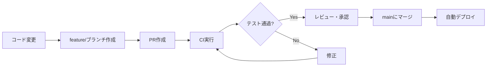

# CI/CD Deployment Setup

このプロジェクトは GitHub Actions を使用して自動デプロイされます。

## 🚀 デプロイフロー

### 1. Continuous Integration (CI)
- **トリガー**: PR作成、feature/*ブランチへのpush
- **処理**: テスト実行、TypeScriptビルド、Docker build検証
- **ファイル**: `.github/workflows/ci.yml`

### 2. Continuous Deployment (CD)
- **トリガー**: mainブランチへのpush（マージ完了時）
- **処理**: 
  1. テスト実行
  2. Google Cloud Buildでビルド・デプロイ
  3. マイクロサービスデプロイ
  4. Firebase Database rulesデプロイ
- **ファイル**: `.github/workflows/deploy.yml`

## 🔐 必要なGitHub Secrets

リポジトリの Settings > Secrets and variables > Actions で以下を設定してください：

### 必須Secrets

| Secret名 | 説明 | 取得方法 |
|---------|------|---------|
| `GCP_SA_KEY` | Google Cloud サービスアカウントのJSONキー | GCP Console > IAM > Service Accounts |
| `FIREBASE_TOKEN` | Firebase CLI トークン | `firebase login:ci` |
| `GEMINI_API_KEY` | Google Gemini API キー | GCP Console > APIs & Services |

### GCP サービスアカウント権限

`GCP_SA_KEY` のサービスアカウントには以下の権限が必要です：

```bash
# 必要なロール
- Cloud Build Editor
- Cloud Run Admin
- Container Registry Service Agent
- Secret Manager Secret Accessor
- Service Account User
```

### サービスアカウント作成例

```bash
# サービスアカウント作成
gcloud iam service-accounts create github-actions \
  --display-name="GitHub Actions" \
  --project=turtle-buttler

# 権限付与
gcloud projects add-iam-policy-binding turtle-buttler \
  --member="serviceAccount:github-actions@turtle-buttler.iam.gserviceaccount.com" \
  --role="roles/cloudbuild.builds.editor"

gcloud projects add-iam-policy-binding turtle-buttler \
  --member="serviceAccount:github-actions@turtle-buttler.iam.gserviceaccount.com" \
  --role="roles/run.admin"

gcloud projects add-iam-policy-binding turtle-buttler \
  --member="serviceAccount:github-actions@turtle-buttler.iam.gserviceaccount.com" \
  --role="roles/storage.admin"

gcloud projects add-iam-policy-binding turtle-buttler \
  --member="serviceAccount:github-actions@turtle-buttler.iam.gserviceaccount.com" \
  --role="roles/secretmanager.secretAccessor"

# キー生成（これをGCP_SA_KEYにセット）
gcloud iam service-accounts keys create key.json \
  --iam-account=github-actions@turtle-buttler.iam.gserviceaccount.com
```

## 📋 デプロイプロセス

### 1. 開発フロー


### 2. 自動デプロイ対象
- **メインアプリケーション**: Google Cloud Run
- **マイクロサービス**: user-profile-service, rakuten-server
- **Database Rules**: Firebase Realtime Database

### 3. デプロイ先URL
- **Production**: https://turtle-buttler-65391589168.asia-northeast1.run.app
- **Cloud Console**: https://console.cloud.google.com/run

## 🛠️ ローカル開発

### mise コマンド使用
```bash
# 開発環境セットアップ
mise install
mise run install
mise run build
mise run test

# デプロイテスト
mise run deploy-all
```

### 手動デプロイ
```bash
# Cloud Build経由
gcloud builds submit --config=infrastructure/cloudbuild/cloudbuild.yaml .

# または mise コマンド
mise run deploy
```

## 🔍 トラブルシューティング

### デプロイ失敗時の確認事項

1. **GitHub Secrets確認**
   - GCP_SA_KEY が正しく設定されているか
   - サービスアカウントに適切な権限があるか

2. **Cloud Build ログ確認**
   ```bash
   gcloud builds list --limit=5
   gcloud builds log BUILD_ID
   ```

3. **Cloud Run サービス確認**
   ```bash
   gcloud run services list
   gcloud run services describe turtle-buttler --region=asia-northeast1
   ```

4. **Secret Manager確認**
   ```bash
   gcloud secrets list
   gcloud secrets versions access latest --secret="GEMINI_API_KEY"
   ```

## 📞 サポート

デプロイに関する問題があれば、以下を確認してください：
- GitHub Actions のワークフロー実行ログ
- Google Cloud Build のビルドログ
- Cloud Run のサービスログ